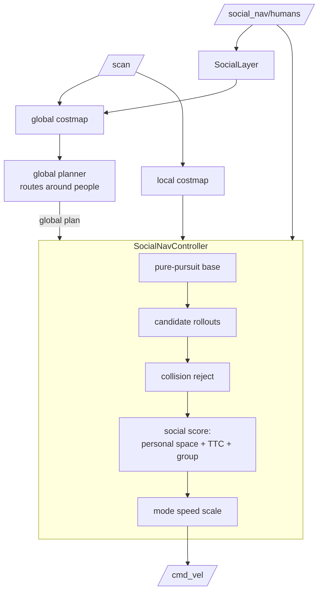

# Architecture

The planner is a Nav2 controller plugin plus a social costmap layer. It consumes `/scan`,
`/odom`, TF, and `/social_nav/humans`, and publishes `/cmd_vel` — nothing simulator-specific.

## Two layers

**Global (`social_nav_costs::SocialLayer`)** stamps each person's anisotropic personal-space
cost into the global costmap, so the global planner plans a path around people. The cost is
soft (below the lethal/inscribed band) so a passable gap is never turned into a wall.

**Local (`social_nav_controller`)** follows the global plan with a pure-pursuit base
command. Candidate `(v, ω)` rollouts around that base are rejected if they hit the costmap,
then scored by the social cost model. A behaviour mode (normal/cautious/crowded/emergency,
with hysteresis to avoid flapping) scales speed with how close and urgent people are.

The base command does the path following; the social terms only perturb it. With no people
the controller reduces to plain pure pursuit. This is deliberate — a from-scratch DWA cost
landscape was fragile to tune, whereas perturbing a known-good base is stable.

## Core math (`social_nav_core`)

Kept free of ROS dependencies so it can be unit-tested in isolation:

- Anisotropic personal-space cost: a Gaussian in the person's heading frame, larger in
  front than to the side than behind.
- Closest approach / time-to-collision under constant relative velocity, so "1.5 m away
  and approaching" is treated differently from "1.5 m away and leaving".
- Trajectory rollout, collision checking, weighted scoring, and behaviour-mode selection.

## Safety ordering

Collision avoidance and dynamic-collision prediction come before human comfort, which comes
before path/goal efficiency. Unsafe trajectories are rejected before scoring, so social
preference can never trade away a collision.
