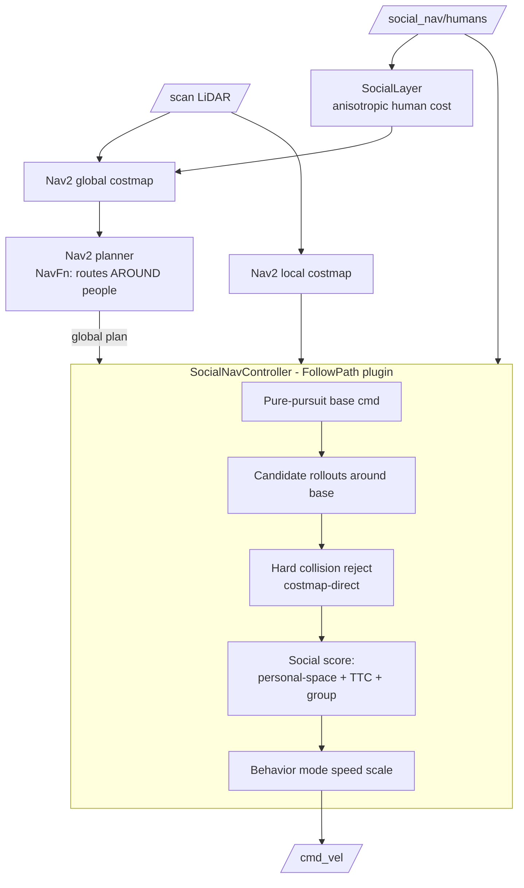

# Architecture

The SocialNav planner is a Nav2 controller plugin plus a social costmap layer. It is
**simulator-agnostic**: it consumes `/scan`, `/odom`, TF, and `/social_nav/humans`, and
emits `/cmd_vel`.

## Data flow

## Two layers of social behavior

1. **Global (SocialLayer, `social_nav_costs`)** — stamps each person's anisotropic
   personal-space cost into the global costmap. The global planner then plans a path that
   goes *around* people. The cost is soft (below lethal) so a physically-passable gap is
   never made impassable (§22).
2. **Local (`social_nav_controller`)** — a pure-pursuit base command follows the global
   plan reliably; candidate `(v, ω)` rollouts around it are hard-rejected for collisions,
   then scored by the social cost model (anisotropic personal space §10, time-to-closest-
   approach §11, group intrusion §13). A behavior mode (NORMAL/CAUTIOUS/CROWDED/EMERGENCY,
   §20, with hysteresis §23) scales speed by how close/urgent people are.

Design choice: path-following is done by the reliable pure-pursuit base; the social terms
only *perturb* it. With no people, the controller collapses to pure pursuit (a normal
planner, §21). This avoids the fragility of a from-scratch DWA cost landscape.

## Core math (`social_nav_core`, ROS-free, unit-tested)

- **Anisotropic social cost** (§10): a Gaussian in the person's heading frame with
  front > side > rear extent.
- **Closest approach / TTC** (§11): time & distance of closest approach under constant
  relative velocity — distinguishes "1.5 m away moving toward me" from "moving away".
- **Trajectory generation** (§16) and **collision** (§17-18).
- **Trajectory scorer** (§19) and **behavior modes** (§20/§23).

Keeping this ROS-free means it is covered by fast GoogleTest unit tests (§35, 68 tests) in
isolation from the middleware.

## Safety hierarchy (§48)

1. Physical collision avoidance (hard reject against the costmap)
2. Dynamic collision prediction (TTC)
3. Human comfort (social cost)
4. Path efficiency
5. Goal efficiency

A lower-priority objective never overrides a higher one: unsafe trajectories are rejected
before scoring, so social preference can never trade away collision safety.

## Related docs
- [`../MASTER_PROMPT.md`](../MASTER_PROMPT.md) — the binding spec
- [`TUNING.md`](TUNING.md) — every parameter explained
- [`BENCHMARKING.md`](BENCHMARKING.md) — how to run the evaluation
- [`troubleshooting.md`](troubleshooting.md) — common issues
- [`../IMPLEMENTATION_STATUS.md`](../IMPLEMENTATION_STATUS.md) — honest phase/DoD state
